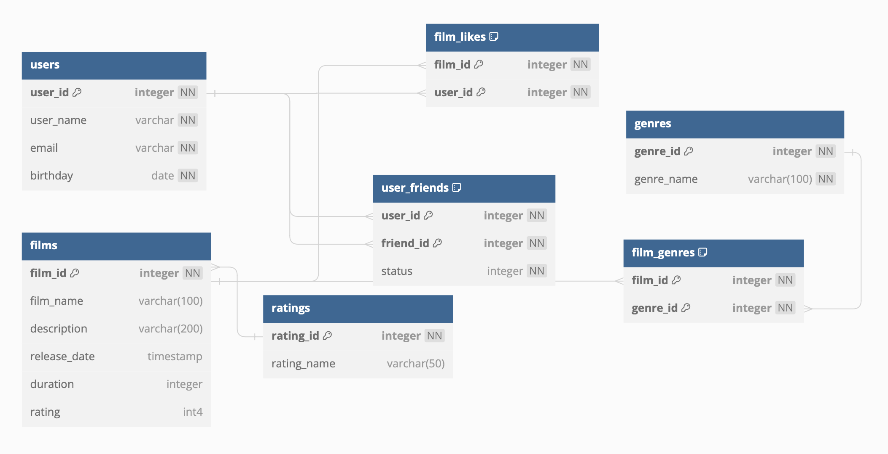

# java-filmorate
Template repository for Filmorate project.

## ER Diagram (https://dbdiagram.io/d/64954c9502bd1c4a5ef34cb7)
=======

#
Приложение помогающее осуществлять подбор фильмов по рейтингам и отзывам пользователей.
  
### Функции:  
- создание пользователей;  
- создание карточек фильмов;  
- написание отзывов к фильмам;
- голосование (лайк/дизлайк) по отзывам;
- поиск фильмов по параметрам;

### Описание:
- Java 11;
- Spring boot, Spring Boot Web,JDBC template;
- H2 или PostgresSQL.

### Запуск:
Для запуска необходимо запустить метод Main класса FilmorateApplication.java
